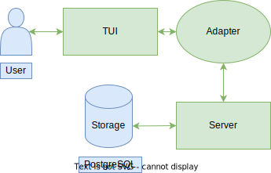
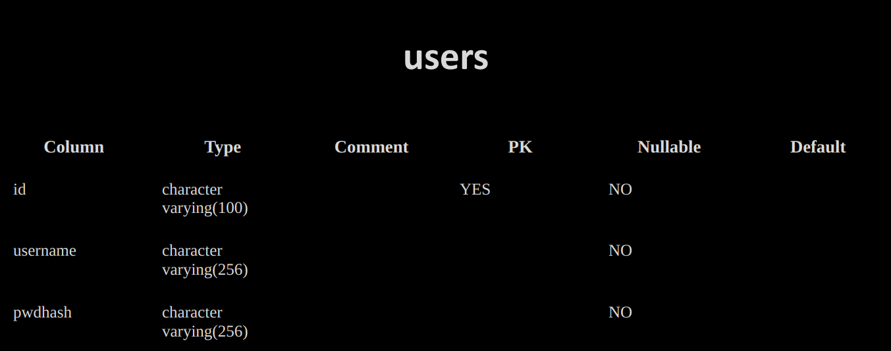
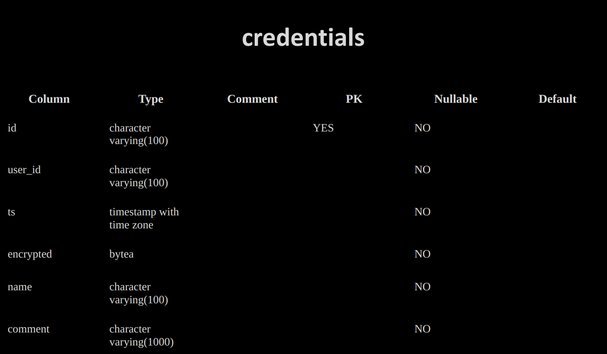
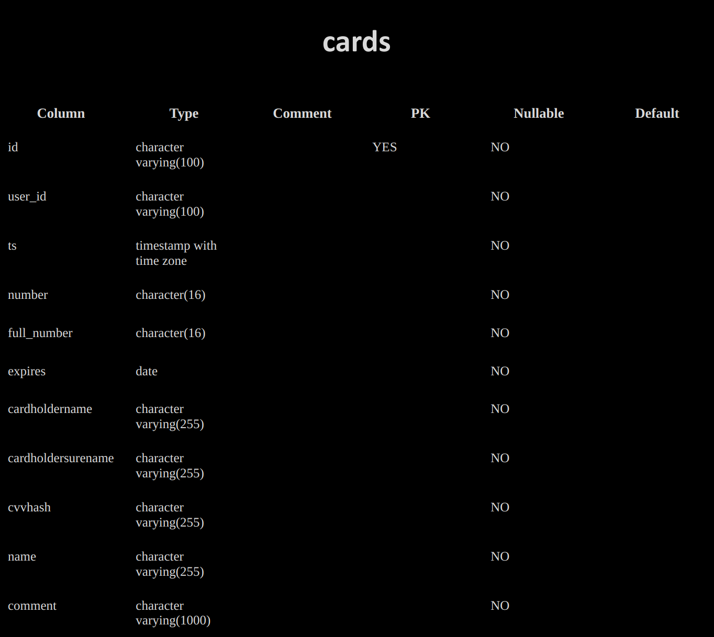
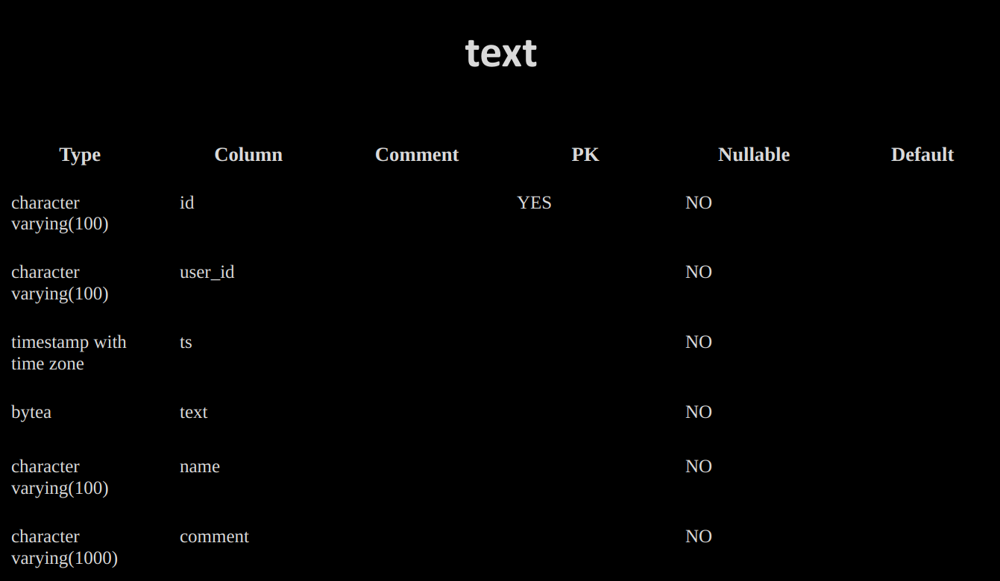
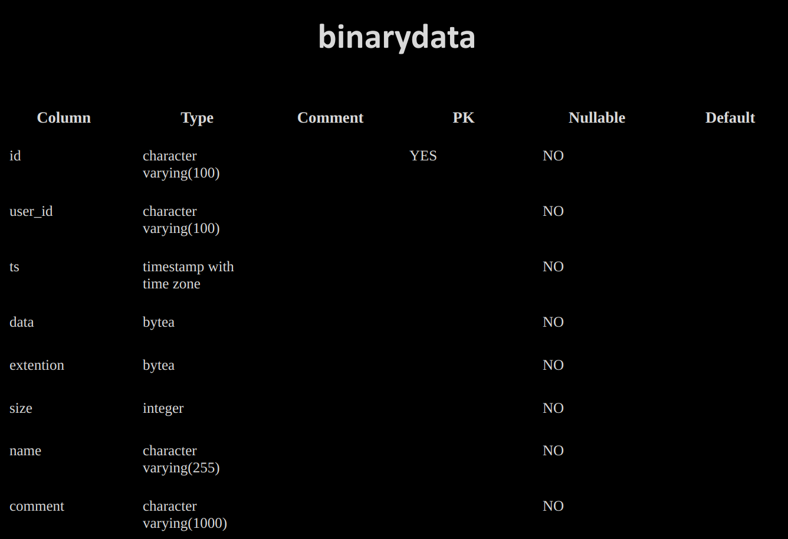

## Ghost Orange

This is basicly a storage that can store various types of data like **`text data, binary data, credentials and bank card info`**. It provides simple tui that access server via http.



### Features:
Server is able to store, add and update data of text, binary and card info types. It provides simple rest-API (see [server](./internal/app/server/server.go) package) that can be accessed via http; https is not supported at the moment.

By default server uses [config file](./configs/srv.json). But can also recieve flags and env vars.
```
srvbin -c ./configs/srv.json
```

Access to bank cards data requires authorization via CVV-code input. The code is not stored openly. Code verification is the same as used to verify password, see [argon2hash](./internal/pkg/argon2hash/argon2hash.go) package.

### Endpoints:
The data-related API is really simple. There're just three basic handlers: 
```
GET: /v1/data?data_type={data_type} 
POST: /v1/data?data_type={data_type} 
PUT: /v1/data?data_type={data_type}
```

At the the moment no pagination is supported by the GET method which is a must for future improvement. Another issue is that GET returns full data which is not nessesary. Some fields (like text and data) should be requested only when an object requested specifically.

At the momemt service provides no data deletion methods. 

There is one data-specific handler:
```
GET: /v1/data/cards/{id} 
```
It expects cvv code in request body. Server copares it to the stored cvv-hash and returns revealed card information.

For authentication there are two handlers:
```
POST: /users/register
POST: /users/login
```
Both expect json credentials struct and set JWT authorization cookie header.

Service uses JWT token to manage sessions while there's no auto-renewal mechanism (see [session](./internal/app/auth/session/session.go) package).

To store users and data there is a PostgreSQL [implementation](./internal/app/storage/psqldb/psqldb.go) of [storage](./internal/app/storage/storage.go) interface. See data model [here](#data-model).

Speaking of improvement, server lacks login validation, pwd comlexity check and top1000 password list search. It would also be nice to have client able to store tokens.

Service implements server-side [encryption](./internal/pkg/encryption/encryption.go) for credentials datatype. 

### Client:
This project also offers a TUI [client](./cmd/client/main.gocmd/client/main.go). While the client requires major improvement, it does provide access to basic features of the service. 

The client is only configured by server address and log file path. 
```
clientbin -a localhost:8080 -l log.txt
```

For binary data TUI offers save-to-file and update-from-file buttons that live up to their names. And there's, again, plenty of room for improvement UX-wise, but they do the job.

The client also shows the client version and build date on the login page which is one of the project requirements (see [Makefile](./Makefile) and [appinfo](./internal/app/tui/appinfo/appinfo.go) package). 

To access the server client uses Adapter (see [adapter](./internal/app/adapter/adapter.go) package). At the moment there's only http-client implementation.

Another general issue of the project is complete absence of user input verification. 

### Build and run:
This project includes a [docker-compose file](./build/docker-compose.yml) that builds containers with postgres, nginx proxy and ghostorange service. Nginx is [cofigured](./configs/nginx.conf) to limit request rate to login endpoint. Ghostorange [dockerfile](./build/dockerfile) builds container from projects source code.

To run server with default config only you can use MakeFile.
On linux run:
```
make run-srv-linux
``` 

On windows run:
```
make run-srv-windows
``` 

On mac run:
```
make run-srv-darwin
``` 

Same goes for client.

On linux run:
```
make run-tui-linux
``` 

On windows run:
```
make run-tui-windows
``` 

On mac run:
```
make run-tui-darwin
``` 

You can also run tests with:
```
make test
``` 

## Data model




